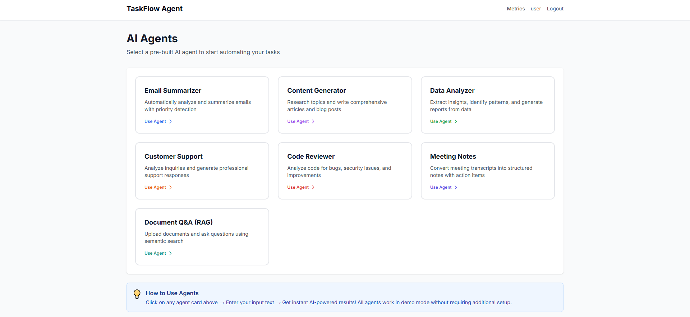
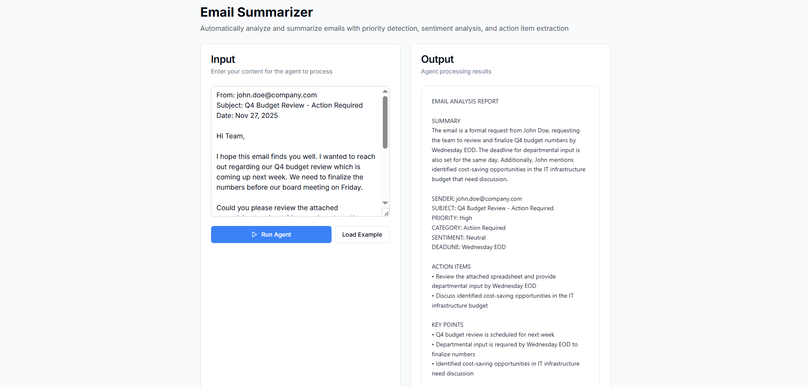
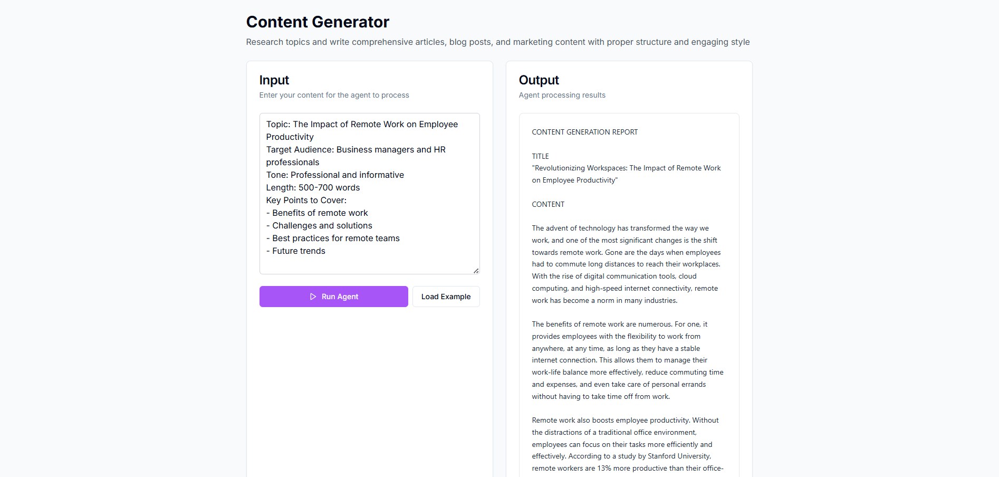
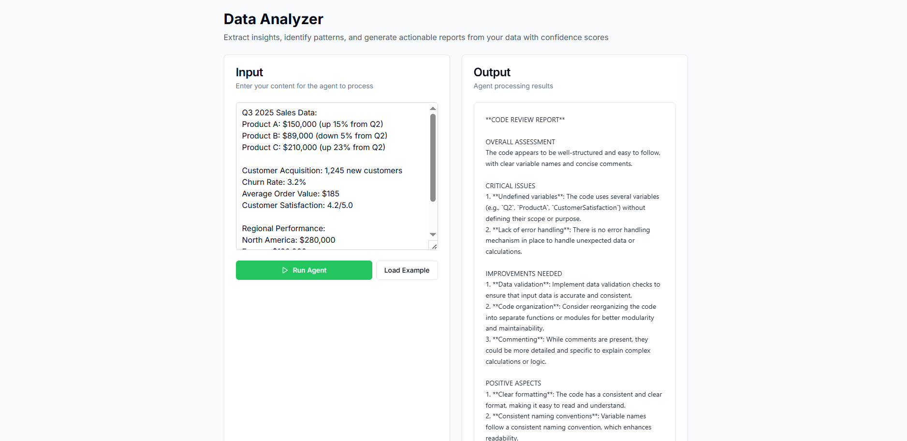
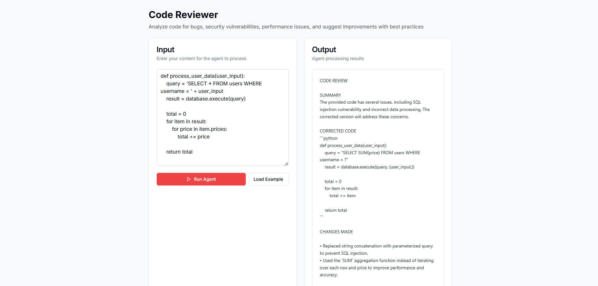

# TaskFlow Agent

> AI-Powered Agent Platform for Business Automation

An intelligent AI agent platform that provides pre-built AI agents for common business tasks including email analysis, content generation, data analysis, code review, customer support, and meeting notes.

[](https://github.com/shreyaupretyy/taskflow-agent)
[](LICENSE)

## Overview

TaskFlow Agent simplifies business automation by providing ready-to-use AI agents powered by Ollama and LLaMA 3.2. No workflow building required - just select an agent, provide your input, and get instant AI-generated results.

## Features

### Pre-Built AI Agents

- **Email Summarizer** - Analyze emails and extract key information, action items, and priorities
- **Content Generator** - Create professional content including articles, blogs, and marketing copy
- **Data Analyzer** - Analyze data and provide insights, patterns, and recommendations
- **Code Reviewer** - Review code and provide corrected versions with fixes
- **Customer Support** - Generate professional customer support responses
- **Meeting Notes** - Convert meeting transcripts into structured notes with action items
- **Document Q&A (RAG)** - Upload documents and ask questions using Retrieval Augmented Generation

### Advanced AI Capabilities

- **Multiple Model Support** - Compare responses from different LLMs (llama3.2, mistral, etc.)
- **Vector Search (ChromaDB)** - Semantic search across uploaded documents with local embeddings
- **Performance Metrics** - Track response times, token usage, and success rates for each agent
- **Quality Ratings** - Rate agent responses and provide feedback to improve performance
- **Real-time Analytics** - Monitor agent usage patterns and performance trends

### Key Capabilities

- Real AI processing with Ollama (LLaMA 3.2)
- Clean, professional UI without distractions
- Human-readable reports (not JSON)
- Fast response times (3-8 seconds after first load)
- Secure JWT authentication
- Copy results to clipboard
- Demo mode fallback when Ollama is unavailable
- Model comparison for A/B testing
- Comprehensive metrics tracking
- CI/CD pipeline with automated testing

## Screenshots

### Dashboard


### Email Summarizer


### Content Generator


### Data Analyzer


### Code Reviewer


## Technology Stack

### Backend
- **FastAPI** - High-performance async API framework
- **SQLAlchemy** - ORM with SQLite database
- **Ollama** - Local LLM inference (LLaMA 3.2, Mistral, and more)
- **LangChain** - LLM framework for agent orchestration
- **ChromaDB** - Vector database for RAG and semantic search
- **HuggingFace Embeddings** - Sentence transformers for document embeddings
- **Argon2** - Password hashing
- **JWT** - Secure authentication
- **Pytest** - Comprehensive test coverage

### Frontend
- **Next.js 14** - React framework with App Router
- **TypeScript** - Type-safe development
- **Tailwind CSS** - Modern styling
- **Zustand** - State management
- **shadcn/ui** - UI components

## Quick Start

### Prerequisites

- Python 3.11+
- Node.js 18+
- Ollama ([Download](https://ollama.ai))

### Installation

1. **Clone the repository**
```bash
git clone https://github.com/shreyaupretyy/taskflow-agent.git
cd taskflow-agent
```

2. **Backend Setup**
```bash
cd backend

# Create virtual environment
python -m venv venv

# Activate virtual environment
venv\Scripts\activate  # Windows
# source venv/bin/activate  # Linux/Mac

# Install dependencies
pip install -r requirements.txt

# Setup environment
cp .env.example .env
# Edit .env and set DEFAULT_MODEL=llama3.2
```

3. **Frontend Setup**
```bash
cd frontend

# Install dependencies
npm install

# Setup environment
cp .env.example .env.local
```

4. **Install Ollama and Model**
```bash
# Download Ollama from https://ollama.ai

# Pull LLaMA 3.2 model
ollama pull llama3.2

# Start Ollama (it usually runs automatically as a service)
ollama serve
```

### Running the Application

**Terminal 1 - Backend:**
```bash
cd backend
venv\Scripts\activate
uvicorn app.main:app --reload
```

**Terminal 2 - Frontend:**
```bash
cd frontend
npm run dev
```

**Access the Application:**
- Frontend: http://localhost:3000
- Backend API: http://localhost:8000
- API Docs: http://localhost:8000/docs

### First Time Setup

1. Navigate to http://localhost:3000
2. Click "Register" to create an account
3. Login with your credentials
4. Select any agent from the dashboard
5. Enter your text and click "Run Agent"
6. Get AI-generated results in seconds!

## Usage Guide

### Email Summarizer
Analyzes emails and provides:
- Concise summary
- Sender and subject information
- Priority level and category
- Action items with deadlines
- Key points

**Example Input:**
```
From: john@company.com
Subject: Q4 Budget Review - Action Required

Hi team, we need to finalize our Q4 budget numbers by Wednesday EOD. 
Please review the attached spreadsheet and provide your department's input.
```

### Content Generator
Creates professional content including:
- Engaging title
- Well-structured content
- Word count and metadata
- Key takeaways

**Example Input:**
```
Write a blog post about the benefits of AI automation in business
```

### Data Analyzer
Provides comprehensive analysis with:
- Executive summary
- Key insights
- Identified patterns
- Actionable recommendations

**Example Input:**
```
Analyze this sales data: Q1: $50K, Q2: $75K, Q3: $90K, Q4: $120K
```

### Code Reviewer
Reviews code and provides:
- Brief summary of issues
- Complete corrected code
- List of changes made

**Example Input:**
```python
def calculate(x,y):
    result = x+y
    return result
```

## Advanced AI Features

### RAG (Retrieval Augmented Generation)

Upload documents and query them using semantic search:

```python
# Upload documents to create knowledge base
POST /api/v1/documents/upload

# Query documents with natural language
POST /api/v1/agents/execute
{
  "agent_id": "document-qa",
  "input_text": "What are the key findings in the uploaded reports?"
}
```

**Key Benefits:**
- Local vector embeddings (no external API calls)
- Semantic search with ChromaDB
- Citation of source documents
- Confidence scoring

### Model Comparison

Compare outputs from different models side-by-side:

```python
POST /api/v1/agents/compare-models
{
  "agent_id": "content-generator",
  "input_text": "Write a blog post about AI ethics",
  "models": ["llama3.2", "mistral", "llama2"]
}
```

**Returns:**
- Outputs from all models
- Response time comparison
- Quality metrics
- Model performance stats

### Performance Analytics

Track detailed metrics for every execution:

```python
GET /api/v1/agents/metrics?agent_type=extractor
GET /api/v1/agents/my-stats?days=30
```

**Available Metrics:**
- Total executions per agent
- Success rate percentages
- Average response times
- Token usage tracking
- User ratings and feedback
- Usage patterns over time

### Quality Ratings

Rate agent responses to improve performance:

```python
POST /api/v1/agents/rate
{
  "execution_id": 123,
  "rating": 5,
  "feedback": "Excellent analysis with clear action items"
}
```

## Configuration

### Backend (.env)
```env
# Database
DATABASE_URL=sqlite:///./taskflow.db

# Security
SECRET_KEY=your-secret-key-here
ALGORITHM=HS256
ACCESS_TOKEN_EXPIRE_MINUTES=30

# Ollama
OLLAMA_BASE_URL=http://localhost:11434
DEFAULT_MODEL=llama3.2
TEMPERATURE=0.7

# CORS
CORS_ORIGINS=["http://localhost:3000", "http://127.0.0.1:3000"]
```

### Frontend (.env.local)
```env
NEXT_PUBLIC_API_URL=http://localhost:8000
```

## Architecture

```
taskflow-agent/
├── backend/
│   ├── app/
│   │   ├── agents/          # AI agent implementations
│   │   │   ├── base_agent.py
│   │   │   └── rag_agent.py # RAG with ChromaDB
│   │   ├── api/
│   │   │   └── routes/      # API endpoints
│   │   │       ├── auth.py
│   │   │       └── agents.py # Includes metrics & comparison
│   │   ├── core/            # Configuration and security
│   │   ├── models/          # Database models
│   │   │   ├── user.py
│   │   │   └── agent_execution.py # Metrics tracking
│   │   ├── services/        # Business logic
│   │   │   └── metrics_service.py
│   │   └── main.py
│   ├── tests/               # Pytest test suite
│   │   └── test_agents.py
│   ├── requirements.txt
│   └── .env
│
├── frontend/
│   ├── src/
│   │   ├── app/             # Next.js pages
│   │   │   ├── auth/        # Login/Register
│   │   │   ├── dashboard/   # Main dashboard
│   │   │   ├── agents/      # Agent pages
│   │   │   └── metrics/     # Analytics dashboard
│   │   ├── components/      # React components
│   │   │   ├── AgentInterface.tsx
│   │   │   └── MetricsDashboard.tsx
│   │   └── store/           # State management
│   ├── package.json
│   └── .env.local
│
├── .github/
│   └── workflows/           # CI/CD pipelines
│       └── ci-cd.yml
│
└── uploads/                 # Screenshots
```

## Security

- **JWT Authentication** - Secure token-based auth
- **Password Hashing** - Argon2 for secure password storage
- **CORS Protection** - Configured origins only
- **SQL Injection Protection** - SQLAlchemy ORM
- **Rate Limiting Ready** - Backend infrastructure in place
- **Security Scanning** - Automated vulnerability scanning with Trivy in CI/CD

## Testing & Quality Assurance

### Running Tests

**Backend Tests:**
```bash
cd backend
pytest tests/ -v --cov=app
```

**Frontend Type Checking:**
```bash
cd frontend
npm run build
npm run lint
```

### Test Coverage

- **Unit Tests** - Agent logic and business functions
- **Integration Tests** - API endpoints and database operations
- **Type Safety** - TypeScript strict mode
- **Code Quality** - Automated linting with Flake8 and ESLint

### CI/CD Pipeline

Automated workflows on every push:
- Run full test suite
- Code quality checks (Black, isort, Flake8)
- TypeScript compilation
- Security vulnerability scanning
- Coverage reporting

## Troubleshooting

### Ollama Not Connected
**Error:** "Using demo mode - Ollama not connected"

**Solution:**
1. Install Ollama from https://ollama.ai
2. Run `ollama pull llama3.2`
3. Ensure Ollama is running: `ollama serve`
4. Check `OLLAMA_BASE_URL` in backend `.env`

### Backend Won't Start
**Error:** Port already in use

**Solution:**
```bash
# Kill existing Python processes
taskkill /F /IM python.exe  # Windows
# pkill -9 python  # Linux/Mac
```

### Authentication Errors
**Error:** 401 Unauthorized

**Solution:**
1. Logout and login again to refresh token
2. Clear browser localStorage
3. Check backend logs for JWT errors

## Performance

- **First Request:** 15-30 seconds (model loads into RAM)
- **Subsequent Requests:** 3-8 seconds
- **Model Size:** ~2GB (LLaMA 3.2)
- **Memory Usage:** 4-8GB RAM recommended
- **Vector Search:** <100ms for semantic queries
- **Concurrent Requests:** Async FastAPI handles multiple agents simultaneously

## AI/ML Technical Details

### Model Management

**Supported Models:**
```bash
# Pull additional models for comparison
ollama pull mistral
ollama pull llama2
ollama pull codellama
```

**Model Selection:**
- Default: LLaMA 3.2 (2GB, optimized for general use)
- Code tasks: CodeLLaMA (better for programming)
- Speed priority: Mistral (faster inference)
- Accuracy priority: Larger LLaMA variants

### RAG Implementation

**Vector Embeddings:**
- Model: `sentence-transformers/all-MiniLM-L6-v2`
- Dimensions: 384
- Speed: ~50ms per embedding
- Storage: ChromaDB (local, persistent)

**Document Processing:**
- Chunking: 1000 characters with 200 overlap
- Metadata preservation
- Semantic search with relevance scoring
- Top-K retrieval (default: 5 most relevant chunks)

### Performance Optimization

**Caching Strategy:**
- Model weights cached in RAM after first load
- Vector embeddings indexed for fast retrieval
- Database queries optimized with SQLAlchemy

**Metrics Tracking:**
- Response time per execution
- Token usage estimation
- Success/failure rates
- User satisfaction scores

## API Reference

### Key Endpoints

```python
# Execute agent with selected model
POST /api/v1/agents/execute
{
  "agent_id": "content-generator",
  "input_text": "Your input here",
  "model": "llama3.2"  # Optional
}

# Compare multiple models
POST /api/v1/agents/compare-models
{
  "agent_id": "code-reviewer",
  "input_text": "def foo(): pass",
  "models": ["llama3.2", "codellama"]
}

# Get performance metrics
GET /api/v1/agents/metrics?agent_type=extractor

# Get user statistics
GET /api/v1/agents/my-stats?days=30

# Rate execution
POST /api/v1/agents/rate
{
  "execution_id": 123,
  "rating": 5,
  "feedback": "Excellent output"
}
```

## Contributing

Contributions are welcome! Please:

1. Fork the repository
2. Create a feature branch (`git checkout -b feature/amazing-feature`)
3. Commit your changes (`git commit -m 'Add amazing feature'`)
4. Push to the branch (`git push origin feature/amazing-feature`)
5. Open a Pull Request

## License

This project is licensed under the MIT License - see the [LICENSE](LICENSE) file for details.

## Links

- **GitHub Repository:** https://github.com/shreyaupretyy/taskflow-agent
- **Ollama:** https://ollama.ai
- **LLaMA Models:** https://ai.meta.com/llama/

## Acknowledgments

- Ollama team for local LLM infrastructure
- Meta for LLaMA models
- LangChain for agent framework
- FastAPI and Next.js communities

## Support

For issues and questions:
- Open an issue on [GitHub](https://github.com/shreyaupretyy/taskflow-agent/issues)
- Check existing issues for solutions

---

**Built for business automation**
